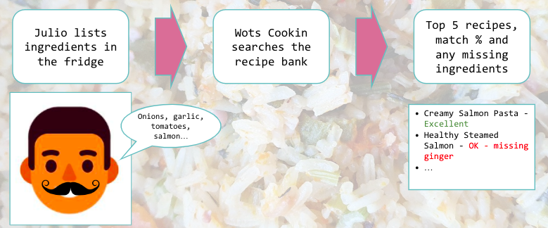
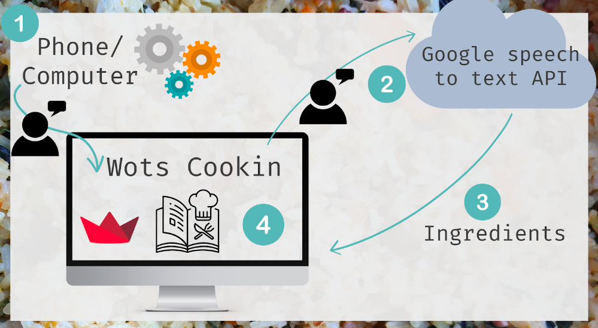
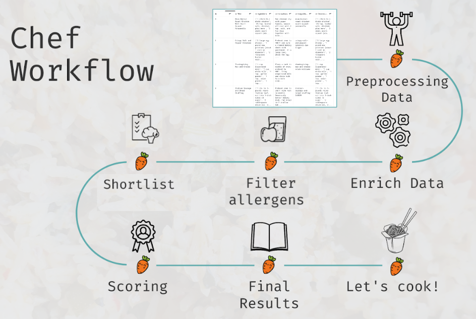
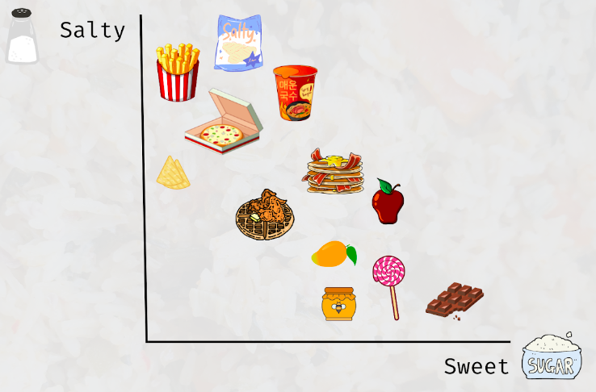

# Wots Cookin

Wots Cookin is an ingredients-to-recipes recommender, which gives the user ideas for meals and drinks based on a list of input ingredients.

## User Journey



- The user lists the ingredients via speech into the web app
- Wots Cookin searches the recipe bank
- Wots Cookin returns an ordered list of best matching recipes with a qualitative match score

## High Level Architecture



1. Wots Cookin is built on a Streamlit web app
2. The user's voice is translated into text via the Google speech-to-text API
3. The ingredients are used as an input into the Wots Cookin search algorithms
4. The Streamlit web app displays the results back to the user

## Data Source
A small Kaggle [dataset](https://www.kaggle.com/datasets/pes12017000148/food-ingredients-and-recipe-dataset-with-images) with approximately 13.5k records is used for the Wots Cookin recipes bank. The source data has 6 features:

1. Row number
2. Title - for the food dish
3. Ingredients
4. Instructions
5. Image Name
6. Cleaned Ingredients - a comma separated version of the 'Ingredients' feature

The dataset is cleaned and enriched further for Wots Cookin. Please see more in the Workflow section.

## Workflow



1. ### Data Preprocessing

This step involves removing any capitalisation, punctuation, formatting and stopwords (e.g. I, you, a pinch of, a dash of), in order to generate a new distilled feature 'bag of ingredients' required for the search process

2. ### Data Enrichment

This involves creating new features:

- ***Dietary requirements*** by tagging allergen information (e.g. dairy, gluten) and dietary restrictions (e.g. vegetarian, vegan)
- ***Ingredients vector*** by representing characteristics of a ingredient (e.g. salty, sweet, spicy, mild) as vectors that can be compared and computed mathematically



3. ### Allergens Filtering

This step involves filtering out recipes based on dietary and minimum ingredients requirements provided by the user

4. ### Shortlisting

This step involves shortlisting the recipes by a cosine similarity score calculated by comparing the ingredients provided by the user with the Wots Cookin recipes bank. This score is calculated using the vectorised ingredients (refer to in 'Ingredients vector' of step 2 of data workflow)

5. ### Scoring

This step involves calculating an accuracy score between the ingredients provided by the user and the shortlished recipes using the following formula:

    number of positive matches / number of ingredients in a recipe

This score is translated into the following qualitative score:

- ***Excellent***: score >= 75%
- ***Good***: score >= 50%
- ***OK***: score < 50%

6. ### Final Results

The final results are displayed as a table of top results, including:

- Recipe title
- Qualitative match score (i.e. excellent, good, ok)
- Key ingredients available

The full recipes are displayed as text, including:

- Recipe title
- Image for the final dish
- Ingredients with the missing key ingredient flagged visually by a red sign
- Cooking instructions

7. ### Let's Cook!

Something for the user to do themselves 😉

## UI Elements

Wots Cookin contains fully interactive UI widgets for users to:

- Convert their voice to text using a single record button and voice recorder
    - implemented using custom Javascript so that the button and recorder can interact with each other
    - the start and stopping of the recorder is events-triggered based on the text on the record button
    - the voice recording is pre-processed using the first step in the data workflow prior to the search process
- Filter by dietary requirements (i.e. 'Vegetarian', 'Vegan', 'Gluten free', 'Nut free','No shellfish', 'No eggs', 'Dairy free', 'No soy' ) using a multiselect side-bar checklist
- Filter by the minimum number of ingredients in a recipe (up to 10) using a  side-bar select box
- Select the number of results displayed
- Review the search results as a summary table and in full with instructions

# Startup the project

For the initial setup, create virtualenv and install the project:
```bash
sudo apt-get install virtualenv python-pip python-dev
deactivate; virtualenv ~/venv ; source ~/venv/bin/activate ;\
    pip install pip -U; pip install -r requirements.txt
```

Unittest test:
```bash
make clean install test
```

Check for wots_cookin in gitlab.com/{group}.
If your project is not set up, please add it:

- Create a new project on `gitlab.com/{group}/wots_cookin`
- Then populate it:

```bash
##   e.g. if group is "{group}" and project_name is "wots_cookin"
git remote add origin git@github.com:{group}/wots_cookin.git
git push -u origin master
git push -u origin --tags
```

Functionnal test with a script:

```bash
cd
mkdir tmp
cd tmp
wots_cookin-run
```

# Install

Go to `https://github.com/denwychan/wots_cookin` to see the project, manage issues,
setup you ssh public key, ...

Create a python3 virtualenv and activate it:

```bash
sudo apt-get install virtualenv python-pip python-dev
deactivate; virtualenv -ppython3 ~/venv ; source ~/venv/bin/activate
```

Clone the project and install it:

```bash
git clone git@github.com:denwychan/wots_cookin.git
cd wots_cookin
pip install -r requirements.txt
make clean install test                # install and test
```
Additional installation steps:
- Install ffmpeg using preferred package manager of choice (e.g. brew)
- Enable Google Speech-to-Text API on GCP

Functionnal test with a script:

```bash
cd
mkdir tmp
cd tmp
wots_cookin-run
```
